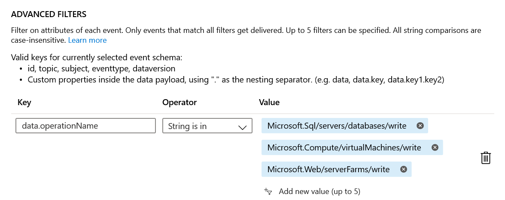

# Automation Account Setup

## Runbooks

Import the following runbooks from the project
- Detect-Resize.ps1
- Tag-OrphanedResources.ps1
- StorageCapacityChange.ps1

## Modules

Import the following module from the PowerShell Gallery into the account in the order listed below
- Az.Accounts
- Az.Storage
- Az.Monitor

> Note: You have to wait until Az.Accounts is completely imported otherwise the other module will fail

## Variables

Create the following variables
- AppURI (Value to be provided when the logic app is created)

## Webhooks

Create a webhook attached to the Detect-Resize runbook - no value needs to supplied to the ```$WebhookData``` parameter.

The resulting URL should be supplied to the event subscription endpoint. 

# Event Grid Subscription

An event subscription is created which detects changes to resources. Changes matching the filters supplied will call the webhook which will trigger the Detect-Resize runbook. 

## Creating the event subscription

- In the portal search for **Event Grid Subscriptions**
- Change the topic type to **Azure Subscriptions** in the drop down and click **+ Event Subscription**
- Supply a name for the new subscription -> change the **Topic Types** to **Azure Subscriptions** and select the subscription.
- Uncheck all the **Filter to Event Types** except for *Resource Write Success*
- Change the **Endpoint Type** to **Webhook** and click **Select Endpoint**
- Use the webhook endpoint generated in the Automation Account above. 
- Click on the **Filters** tab and add an advanced filter as in the image below. For any new resources to track you would have to modify this filter. Using this also prevents every resource write event from triggering the runbook. 



# Logic App Integration

## HTTP Trigger Event

The runbook sends output to a http endpoint which can be a request task in a logic app. Use the following schema as input to the HTTP request.

```
{
    "properties": {
        "NewValue": {
            "type": "string"
        },
        "OldValue": {
            "type": "string"
        },
        "ResourceId": {
            "type": "string"
        }
    },
    "type": "object"
}
```

To get more information modify the runbook and adjust the schema.


